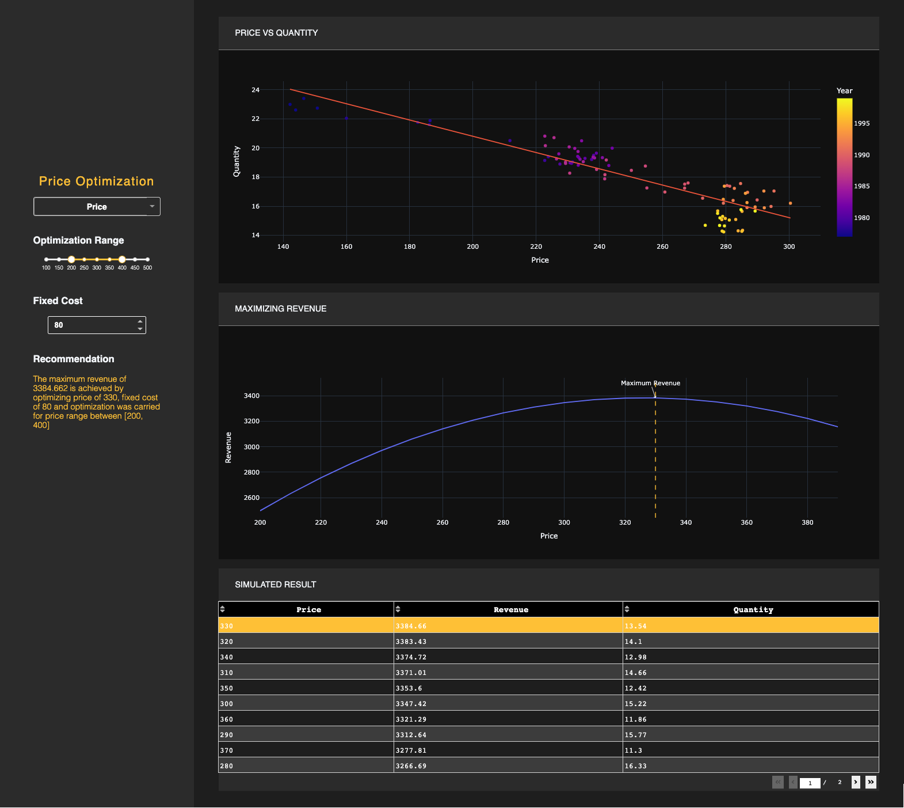

# Price Optimization APP made by Python and Dash

### Preview



### Running the app locally

First create a virtual environment with conda or venv inside a temp folder, then activate it.

Clone the git repo, then install the requirements with pip

```
pip install -r requirements.txt

```

Run the app

```

python app.py

```
